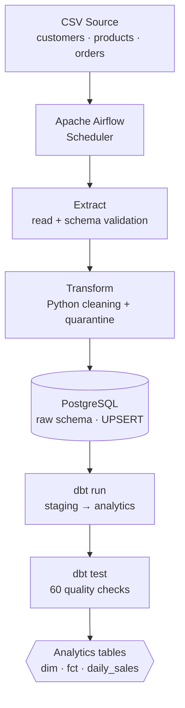

# E-commerce ETL Pipeline — Apache Airflow

An e-commerce ETL pipeline orchestrated by Apache Airflow: CSV extraction,
Python cleaning, **idempotent** loading into PostgreSQL, analytics modelling
with dbt and 60 data quality checks — running automatically every day at
01:00 UTC.


[](https://github.com/AymanMady/airflow-etl-pipeline/actions/workflows/ci.yml)

[](LICENSE)

```bash
make init && make up && make seed && make trigger
```

---

## 1. Project Overview

An ETL script you run by hand is not a production pipeline. It depends on
someone remembering to run it, in the right order, and noticing when it breaks.

This project shows the move from that manual pipeline:

```
CSV / API  →  Python  →  PostgreSQL  →  SQL / dbt
```

to an **orchestrated, scheduled, tested and observable** one, where Airflow
handles scheduling, task dependencies, retries, timeouts and execution logs.

**Business domain:** an online store. Three sources — customers, products,
orders — turned into analytics tables that answer real questions: daily
revenue, average order value, best customers, products that never sell.

**The source data is deliberately dirty**: duplicates, missing values,
malformed emails, negative prices, zero quantities, unknown statuses, mixed
date formats, orphan references. A pipeline only ever tested on clean data
proves nothing.

### A typical run

| Stage | Result |
|---|---|
| Extract | 5,670 rows read from 3 CSV files |
| Transform | 5,270 kept, 400 rejected (7.1%) and quarantined |
| Load | 500 customers · 57 products · 4,713 orders |
| dbt | 7 models built (3 views + 4 tables) |
| Quality | 60 tests — 58 passed, 2 warnings, 0 errors |
| Total runtime | ~35 seconds |

---

## 2. Architecture



### The three warehouse layers

| Schema | Written by | Materialisation | Contents |
|---|---|---|---|
| `raw` | Python (load) | tables | Data loaded as-is, typed, replayable |
| `staging` | dbt | views | Cleaning and derived fields, 1 model = 1 source |
| `analytics` | dbt | tables | `dim_customers`, `dim_products`, `fct_orders`, `daily_sales` |

Why not clean on the way in? Because the day a number looks wrong, you walk
back through the layers to find where it broke — **without ever re-extracting
the source**.

### Two PostgreSQL databases

| Database | Role | Host port |
|---|---|---|
| `postgres-warehouse` | E-commerce data (raw / staging / analytics) | `5435` |
| `postgres-airflow` | Airflow metadata database | **not exposed** |

Airflow records the state of every execution in its *metadata database*: DAG
runs, task instances, retries, durations, XComs, connections. It is **kept
separate from the warehouse** for four reasons: fault isolation (a saturated
warehouse must not stop the orchestrator from reporting the incident), access
control (Airflow's stored secrets are not visible to an analyst), independent
lifecycles, and two incompatible workload profiles.

### Airflow 3's four processes

```
api-server      web UI + REST API                 (port 8089)
scheduler       decides which tasks to run
dag-processor   parses the files in dags/
triggerer       handles deferrable tasks
```

---

## 3. Technologies

| Tool | Version | Role |
|---|---|---|
| Apache Airflow | 3.3.2 | Orchestration, scheduling, observability |
| PostgreSQL | 16.15 | Data warehouse + metadata database |
| Python | 3.12 | ETL logic (extract / transform / load) |
| pandas | 2.x | Tabular data manipulation |
| pyarrow | 17+ | Parquet exchange between tasks (preserves dtypes) |
| dbt-core / dbt-postgres | 1.12 | Analytics modelling + testing |
| Docker / Compose | 28.x / v2 | Reproducible environment |
| pytest | 8.x | Automated tests |
| ruff | 0.x | Linting + formatting |

**Architecture choice:** `LocalExecutor` rather than `CeleryExecutor`. For a
pipeline that processes 5,000 rows in 35 seconds, adding Redis and separate
workers would buy nothing but complexity.

**dbt lives in its own virtualenv** (`/opt/dbt_venv`) inside the Airflow image.
The two projects pin different versions of the same libraries (Jinja2, click);
installing them side by side breaks one of them sooner or later.

---

## 4. Project Structure

```
airflow-etl-pipeline/
├── dags/
│   └── ecommerce_daily_etl.py       # the DAG: what, when, in which order
├── src/                             # business logic, testable without Airflow
│   ├── extract/extract.py           # read + validate sources
│   ├── transform/transform.py       # cleaning + quarantine
│   ├── load/
│   │   ├── load.py                  # idempotent loading (UPSERT)
│   │   └── sql/raw_tables.sql       # replayable DDL
│   └── utils/
│       ├── config.py                # centralised configuration
│       ├── datasets.py              # dataset contracts
│       ├── exceptions.py            # business errors, retryable or not
│       └── logging_setup.py
├── dbt/ecommerce_dbt/
│   ├── models/staging/              # stg_customers, stg_products, stg_orders
│   ├── models/marts/                # fct_orders, dim_*, daily_sales
│   ├── tests/                       # singular tests
│   ├── macros/                      # generic tests + generate_schema_name
│   ├── dbt_project.yml
│   └── profiles.yml
├── data/
│   ├── raw/                         # source CSVs (not versioned)
│   └── processed/<date>/            # intermediate Parquet + quarantine
├── tests/                           # 55 pytest tests
├── docker/
│   ├── postgres/init/               # schemas + UTC timezone
│   └── airflow/Dockerfile           # custom image (ETL deps + isolated dbt)
├── scripts/
│   ├── generate_data.py             # generates the demo CSVs
│   ├── run_pipeline.py              # pipeline without Airflow
│   ├── demo_idempotency.sh
│   └── demo_failures.sh
├── docker-compose.yml
├── Makefile                         # 29 documented targets
└── .env.example
```

**Key separation:** `src/` holds the business logic — testable with pytest,
without Airflow. `dags/` holds orchestration only. If all the logic lived in
the DAG, it could only be tested by starting Airflow.

---

## 5. Installation

**Requirements:** Docker Engine 24+, Docker Compose v2, GNU Make. Python 3.12+
only if you want to run the tests outside the containers.

```bash
git clone <repository-url>
cd airflow-etl-pipeline

make init      # creates .env with your UID and generated keys
make venv      # local Python environment (tests, pipeline outside Airflow)
make up        # starts PostgreSQL + Airflow, waits for healthy
make seed      # generates the demo CSVs
```

Edit `.env` to change the passwords before any real use.

---

## 6. Docker Setup

| Command | Effect |
|---|---|
| `make up` | Start everything and wait for *healthy* |
| `make down` | Stop — **data is preserved** |
| `make ps` | Container status |
| `make logs` | Live logs |
| `make psql` | SQL session on the warehouse |
| `make tools` | Adminer on `localhost:8083` |
| `make reset` | **Destroys** the databases and replays the init scripts |
| `make clean` | Removes Python caches and dbt artifacts |

Raw Docker equivalents:

```bash
docker compose up -d --wait   # start and wait for healthy
docker compose ps             # status
docker compose logs -f        # logs
docker compose down           # stop, data PRESERVED
docker compose down -v        # stop and DESTROY the volumes
```

### Ports

| Service | Host port |
|---|---|
| Airflow UI | **8089** |
| `postgres-warehouse` | **5435** |
| Adminer (`tools` profile) | **8083** |
| `postgres-airflow` | none (deliberate) |

All configurable in `.env`.

---

## 7. Airflow Setup

UI: <http://localhost:8089> — credentials in `.env`
(`AIRFLOW_ADMIN_USER` / `AIRFLOW_ADMIN_PASSWORD`).

### Using the interface

| View | What it shows | When to use it |
|---|---|---|
| **Dags** | list, last state, next run | daily overview |
| **Grid** | dates × tasks grid, coloured by state | *the* troubleshooting view |
| **Graph** | the DAG and its dependencies | understanding the flow |
| **Logs** | full output of one task instance | when a task is red |
| **Duration** | task duration over time | spotting degradation |
| **Calendar** | one square per day | seeing gaps in history |
| **XCom** | values passed between tasks | debugging data hand-off |
| **Code** | the source as Airflow sees it | checking a change was picked up |

**Troubleshooting reflex:** *Grid* view → red cell → click → *Logs* tab → read
the bottom of the log.

---

## 8. Running the Pipeline

```bash
make unpause     # activate the DAG (it will then run at 01:00 UTC)
make trigger     # trigger a run right now
make airflow     # open the UI

make run-local   # run the pipeline WITHOUT Airflow (development)
```

### The DAG

```
extract_data → transform_data → load_data → run_dbt → run_quality_checks
```

A dependency means **"when this one has SUCCEEDED, start the next"**. If
`load_data` fails, `run_dbt` never starts and goes to `upstream_failed` —
rebuilding analytics tables from data that was never loaded would produce
wrong numbers.

### XCom: references, never data

Each task runs in its own process. The hand-off mechanism is **XCom**, but it
writes to the metadata database: pushing a DataFrame through it would be a
mistake (wrong storage for business data, not JSON-serialisable, grows on
every run).

So each task writes its result to **Parquet** on shared storage and only
passes the path. Parquet rather than CSV because it **preserves dtypes** — the
typing carefully built during transformation is not thrown away.

Intermediate files are partitioned by logical date
(`data/processed/2026-09-15/`), so backfilling 15 September leaves the 16th
untouched.

---

## 9. dbt

```bash
make dbt-run     # build the models
make dbt-test    # run the tests
make dbt-docs    # generate documentation
```

### Models

| Layer | Model | Contents |
|---|---|---|
| staging | `stg_customers` | full name, normalised email, signup date |
| staging | `stg_products` | price segment (budget / standard / premium) |
| staging | `stg_orders` | order day, **the revenue definition** |
| marts | `fct_orders` | fact table, one row per order, amount computed |
| marts | `dim_customers` | customer + order count, lifetime value, first/last order |
| marts | `dim_products` | product + units sold, revenue, never-sold flag |
| marts | `daily_sales` | date, orders, customers, quantity, revenue, AOV |

### The single most important decision in the project

Which statuses count as revenue? That definition lives in **one file**
([stg_orders.sql](dbt/ecommerce_dbt/models/staging/stg_orders.sql)):

```sql
(status in ('paid', 'shipped', 'delivered')) as is_revenue
```

Cancellations and returns are counted separately. Scattered across the filters
of fifteen dashboards, this rule would eventually drift.

### The custom-schema trap

By default dbt **concatenates** the target schema and the custom schema:
`analytics` + `staging` = `analytics_staging`. Hence the override in
[macros/generate_schema_name.sql](dbt/ecommerce_dbt/macros/generate_schema_name.sql).
It is one of the first things that confuses newcomers to dbt.

---

## 10. Data Quality

**A dbt test is a SQL query that must return zero rows.** Every returned row is
a violation. You describe what **must not exist**.

### 60 tests

| Category | Examples |
|---|---|
| Uniqueness | `order_id`, `customer_id`, `product_id`, `sales_date` |
| Not null | every key, price, quantity, status |
| Closed domain | `status` ∈ 6 values, `price_segment` ∈ 3 values |
| Bounds | `price >= 0`, `quantity > 0`, `average_order_value > 0` |
| Format | `valid_email` (regular expression) |
| Referential integrity | orders → customers, orders → products |
| Aggregate consistency | `daily_sales` = sum of `fct_orders`, day by day |
| Plausibility | no order dated in the future |

### Severity: the central trade-off

| Severity | Effect | For what |
|---|---|---|
| `error` | **stops the pipeline** | rules whose violation makes the numbers wrong |
| `warn` | logs without blocking | anomalies worth watching that don't affect results |

Setting everything to `error` gives a permanently red pipeline that nobody
looks at. Setting everything to `warn` lets wrong numbers through.

**A concrete example.** Three products have an invalid price and are rejected
during transformation. Every order referencing them therefore becomes an
orphan — 246 rows. That is a **logical consequence of cleaning**, not an
outage. So it warns instead of blocking, with a threshold above which it
becomes blocking again:

```yaml
- relationships:
    arguments:
      to: ref('stg_products')
      field: product_id
    config:
      severity: error
      warn_if: ">0"
      error_if: ">500"
```

> With `severity: warn`, dbt only evaluates `warn_if` and ignores `error_if`.
> To get a real threshold you need `severity: error` plus both bounds.

### Quarantine

Rows rejected during transformation do not vanish: they land in
`data/processed/rejected_*.csv`, **with the reason attached**. Silently
dropping data is one of the worst things you can do in data engineering.

```
rejected - status not in reference list   131
rejected - quantity <= 0                   98
rejected - quantity missing                68
```

---

## 11. Scheduling

```python
schedule="0 1 * * *"                             # every day at 01:00 UTC
start_date=pendulum.datetime(2026, 9, 1, tz="UTC")
catchup=False
max_active_runs=1
dagrun_timeout=timedelta(hours=1)
```

### Retries

```python
"retries": 2,
"retry_delay": timedelta(minutes=5),
```

A large share of production failures are **transient**: a dropped connection,
a database restarting, a momentary lock. Without retries, a ten-second
incident at 01:00 turns into a missing day of data.

| Worth retrying | Should NOT be retried |
|---|---|
| network error | missing source file |
| database unavailable | missing column |
| connection timeout | invalid data |
| concurrent lock | SQL syntax error |
| third party throttling (503, 429) | failing quality test |

Every exception in [src/utils/exceptions.py](src/utils/exceptions.py) documents
whether it is retryable.

### Timeouts

Without a time limit, a stuck task **never fails**. It stays `running`, holds a
slot, blocks the next run (`max_active_runs=1`) and alerts nobody — because as
far as Airflow is concerned, everything is fine.

Rule of thumb: 3 to 5 times the observed normal duration.

### Catchup

| Setting | Behaviour when the DAG is unpaused |
|---|---|
| `catchup=True` | one run per missed interval since `start_date` |
| `catchup=False` | only the most recent run |

**The trap:** with `start_date` in January and `catchup=True`, unpausing the
DAG in September fires **263 runs at once**.

**Why `catchup=False` here:** the sources are CSVs representing current state,
not dated exports. Replaying 15 September reads the same file as today. Better
to trigger a catch-up explicitly when you actually need one.

*Verified on this project:* `start_date` on 1 September, unpaused on the 21st —
one run created (`scheduled__2026-09-21`), not twenty.

---

## 12. Backfill

**Replaying past dates on demand.**

> The pipeline is created on 20 September, but 15, 16, 17, 18 and 19 still need
> processing.

```bash
make backfill FROM=2026-09-15 TO=2026-09-20
```

Airflow creates one DAG run per date with the correct logical date. `{{ ds }}`
is `2026-09-15` for the first one, and files land in
`data/processed/2026-09-15/`.

### ⚠️ The `--to-date` boundary trap

Hit while building this project:

```bash
--from-date 2026-09-15 --to-date 2026-09-19   # expected 5 runs, got 4
```

A date without a time means **midnight**. The boundary is therefore
`2026-09-19T00:00:00`, while the 19th's run has logical date
`2026-09-19T01:00:00` — past the boundary, so excluded. You need
`--to-date 2026-09-20`.

The symptom is quiet: a day of history is missing and nothing says so.

> `catchup=False` does not prevent backfilling. Catchup governs **automatic**
> catch-up; a backfill is a **manual** action. The two are independent.

**Backfilling only makes sense if the pipeline is idempotent.**

---

## 13. Idempotency

> **Running the operation once or ten times produces exactly the same final
> state.**

```
WITHOUT idempotency                 WITH idempotency
Run 1: 100 orders inserted          Run 1: 100 inserted
Run 2: 100 orders inserted          Run 2: 100 updated
→ 200 rows, revenue doubled         → 100 rows. Always.
```

A pipeline gets rerun constantly: after a network failure, by an automatic
retry, during a backfill, or because a colleague hit *Clear*. **If every rerun
duplicates data, you can never rerun — so you can never repair.**

### How

Primary key + PostgreSQL UPSERT:

```sql
INSERT INTO raw.orders (order_id, customer_id, ...)
VALUES %s
ON CONFLICT (order_id) DO UPDATE SET
    customer_id = EXCLUDED.customer_id,
    ...,
    _loaded_at  = now();
```

### Proving it

```bash
make demo-idempotency
```

```
After run 1: 500 / 57 / 4713
After run 2: 500 / 57 / 4713
RESULT: IDEMPOTENT
```

### No foreign keys in `raw` — a choice, not an oversight

If the export contains an order pointing at a customer that does not exist,
that is valuable information about the upstream system. A foreign key would
fail the whole load over that single row, taking the 4,712 valid orders with
it. Those anomalies are caught later by the dbt `relationships` test: **load
first, measure second, alert third**.

---

## 14. Testing

```bash
make test               # everything
make test-unit          # unit tests only (no database)
make test-integration   # integration tests only (database required)
make lint               # ruff check + format
```

### 55 pytest tests

| File | Covers |
|---|---|
| `test_extract.py` (10) | file present / missing, missing columns, extra columns tolerated, empty file, raw-text fidelity |
| `test_transform.py` (30) | deduplication, nulls, typing, multi-format date parsing, emails, prices, quantities, statuses |
| `test_load.py` (15) | insertion, **idempotency over 10 runs**, UPSERT, CHECK constraints, rollback, password masking |

The load tests are **integration** tests running against a real PostgreSQL.
What we want to verify is precisely the database's behaviour — the UPSERT, the
constraints, the rollback. A mock would only confirm that the code calls the
functions we think it calls.

### Plus 60 dbt tests

```bash
make dbt-test
```

---

## 15. Troubleshooting

| Symptom | Cause and fix |
|---|---|
| `port is already allocated` | Another service holds the port. Change it in `.env`. |
| `make up` times out | `make logs` to find the service. Often a corrupted volume: `make reset`. |
| `raw`/`staging`/`analytics` schemas missing | Init scripts only run on the **first** start with an empty volume → `make reset`. |
| `.env missing` | `make init` |
| Editing `docker-compose.yml` has no effect | `make down && make up` (a `restart` does not re-read the file). |
| DAG not showing in the UI | The `dag-processor` re-reads files periodically — wait ~30 s. Then `airflow dags list-import-errors`. |
| `MissingSourceFileError` | `make seed` to generate the CSVs. |
| A day is missing after a backfill | The `--to-date` boundary is midnight → push it one day further (see §12). |
| dbt models land in `analytics_staging` | The `generate_schema_name` macro is not being picked up. |
| Airflow uses too much memory | Stop other containers. Airflow 3 runs four processes. |

### Simulating failures

```bash
make demo-failures
```

Three real failures, each restored afterwards: missing source file, missing
column, database down. Every error message answers **what / why / how to
fix** — and passwords are masked.

### Rerunning a single task

One of Airflow's real strengths. *Grid* view → red cell → **Clear task**. The
task goes back to `scheduled` and the scheduler picks it up. This only works
**because the pipeline is idempotent**.

```bash
airflow tasks clear ecommerce_daily_etl \
    --task-regex run_dbt --start-date 2026-09-15 --end-date 2026-09-15
```

---

## 16. Future Improvements

- **API source** alongside the CSVs, with pagination and rate-limit handling
- **Incremental loading**: process only the current day's orders
  (`DELETE` + `INSERT` per partition) instead of reloading everything
- **Incremental dbt models** (`materialized='incremental'`) on `fct_orders`
- **Airflow Variables and Connections** instead of environment variables, with
  Fernet-encrypted secrets
- **Alerting** to email / Slack on DAG failure (`on_failure_callback`)
- **Monitoring**: export Airflow metrics to Prometheus + Grafana
- **Data freshness**: `dbt source freshness` tests to detect a stalled source
- **Production setup**: `CeleryExecutor`, multiple workers, externalised secrets
- **CI with GitHub Actions**: lint, unit tests and `dbt compile` on every push

---

## License

MIT
